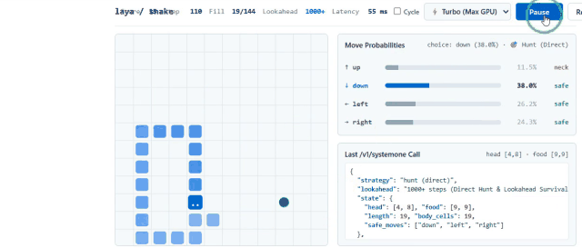

# 🐍 بازی مار هوش مصنوعی لایا (Laya AI Snake) - موتور تصمیم‌گیری سیستم ۱

<p align="center">
  <b><a href="README.md">🇬🇧 English</a></b> | <b><a href="README_FA.md">🇮🇷 فارسی</a></b>
</p>

یک بازی مار فوق‌سریع، هوشمند و کالیبره‌شده از نظر ریاضی که با **مدل تصمیم‌گیری سیستم ۱ لایا ([`convaiinnovations/laya`](https://huggingface.co/convaiinnovations/laya))** و با شتاب سخت‌افزاری **کارت گرافیک انویدیا (CUDA)** بر بستر FastAPI اجرا می‌شود.

این پروژه مجهز به یک **موتور شبیه‌سازی پیش‌بینی آینده دوگانه (Dual-Engine Lookahead +1000 Steps)** در کنار سر استنتاج عصبی مدل لایا است که مانع از به دام افتادن مار در دالان‌های بن‌بست، برخورد با دیوار و چرخش بیهوده دور خود می‌شود و همزمان با حداکثر سرعت سیب‌ها را شکار می‌کند.

---

## 🎮 دموی گیم‌پلی زنده (Gameplay Demo)



> **سرعت استنتاج روی GPU:** حدود ۳۵ تا ۴۵ میلی‌ثانیه برای هر حرکت با کارت گرافیک NVIDIA GeForce RTX 4060. مدل دارای استنتاج غیراوتورگرسیو در یک مرحله (Single Forward Pass) بوده و توهم زبانی ندارد.

---

## 🌟 ویژگی‌های کلیدی

* **⚡ استنتاج محلی و آنی روی کارت گرافیک (CUDA):** اجرای مدل ModernBERT-large با ۴۲۱ میلیون پارامتر به کمک PyTorch و مد `inference_mode` با دقت ترکیبی خودکار (AMP).
* **🧠 پیش‌بینی آینده چندمرحله‌ای (موتور دوگانه هوشمند):**
  * **🎯 شکار مستقیم و سریع (Direct Safe Hunt):** محاسبه کوتاه‌ترین مسیر BFS به سمت سیب و اجرای **شبیه‌سازی فرضی آینده** تا تضمین شود که بعد از خوردن سیب، سر مار حتماً به دم دسترسی دارد و فضای مانور کافی در تخته باقی می‌ماند.
  * **🛡 مانور بقا و تعقیب دم (Tail-Chase Survival):** هرگاه مسیر مستقیم به سیب بسته باشد یا خوردن آن باعث بسته شدن راه خروج شود، مار بلافاصله به حالت بقا تغییر وضعیت داده و با حفظ بیشترین فضای خالی، دم خود را تعقیب می‌کند تا راه خروج به سمت سیب باز شود.
* **🚫 جلوگیری قطعی و ۱۰۰٪ از تله‌ها و برخورد با دیوار:**
  * محاسبه لحظه‌ای ظرفیت هر دالان با الگوریتم Flood-Fill (`space < snake.length + 1 && !tailReachable`).
  * ارسال برچسب‌های معنایی به مدل لایا برای سرکوب قطعی خطرات (`FATAL WALL`, `FATAL BODY`, `DEAD-END TRAP`).
  * گارد محافظتی فیزیکی در کلاینت برای جلوگیری از هرگونه برخورد ناخواسته با دیواره‌ها یا گردن.
* **📊 داشبورد آماری و تعاملی:**
  * میله‌های احتمال لحظه‌ای با درصد دقیق برای هر ۴ جهت (`up`, `down`, `left`, `right`).
  * نمایش استراتژی پویا (`🎯 Hunt (Direct)` در برابر `🛡 Survive (Tail-Chase)`).
  * نمایش زنده درخواست JSON فرستاده‌شده به سرور، تعداد خانه‌های اشغال‌شده بدنه و درصد پر شدن صفحه.

---

## 🏗️ معماری سیستم

```mermaid
graph TD
    A[کلاینت فرانت‌اند: snake.html] -->|ارسال وضعیت فضایی + سوالات| B[سرور FastAPI: server.py]
    B -->|سریال‌سازی وضعیت + معیارهای معنایی| C[مدل لایا ModernBERT روی GPU]
    C -->|احتمالات کالیبره‌شده حرکات| B
    B -->|انتخاب نهایی و معیارهای آماری| A
    A -->|اعمال حرکت و انیمیشن| D[بوم تخته ۱۲ در ۱۲]

    subgraph موتور تصمیم‌گیری و پیش‌بینی
      E[مسیر مستقیم BFS]
      F[شبیه‌سازی مار فرضی در آینده]
      G[محاسبه فضای باز با Flood Fill]
      H[اثبات دسترسی ناپذیری به بن‌بست]
    end

    A <--> موتور تصمیم‌گیری و پیش‌بینی
```

### چرخه تصمیم‌گیری در هر گام:
1. **درک محیط:** کلاینت مختصات سر، غذا، ابعاد شبکه ۱۲×۱۲ و تمام قطعات بدن مار را استخراج می‌کند.
2. **پیش‌بینی فرضی آینده:** مسیر رسیدن به غذا شبیه‌سازی می‌شود. اگر بعد از خوردن غذا سر به دم برسد، حرکت به عنوان **شکار ۱۰۰٪ امن** تایید می‌شود.
3. **برچسب‌گذاری خطرات:** مسیرهایی که به دیوار، گردن، بدنه یا دالان‌های بدون راه خروج می‌رسند، به عنوان حرکت مرگبار علامت‌گذاری می‌شوند.
4. **استنتاج سیستم ۱ لایا:** مدل ModernBERT در ۳۵ میلی‌ثانیه وضعیت و گزینه‌ها را بررسی کرده و بالاترین احتمال را به امن‌ترین و کوتاه‌ترین جهت اختصاص می‌دهد.
5. **اجرای حرکت:** صفحه بازی با نرخ ۱۵ تا ۴۵ میلی‌ثانیه یا حالت توربو به‌روزرسانی می‌شود.

---

## 🚀 راهنمای نصب و اجرای سریع

### پیش‌نیازها
* ویندوز، لینوکس یا مک دارای **پایتون نسخه ۳.۱۰ به بالا**.
* کارت گرافیک انویدیا با پشتیبانی از CUDA (یا اجرای بهینه‌شده روی پردازنده چند‌هسته‌ای).
* فایل‌های وزن‌های مدل لایا به صورت محلی:
  ```bash
  # مثال: دانلود مدل در مسیر C:\AI\Models\laya
  git clone https://huggingface.co/convaiinnovations/laya C:\AI\Models\laya
  ```

### مرحله ۱: نصب کتابخانه‌های پایتون
```bash
pip install -r requirements.txt
```

### مرحله ۲: اجرای سرور لایا
اگر مدل در مسیری به جز `C:\AI\Models\laya` قرار دارد، متغیر محیطی را تنظیم کنید و سپس سرور را اجرا کنید:
```bash
# در صورت نیاز به تغییر مسیر مدل:
set LAYA_MODEL_PATH=C:\AI\Models\laya

# اجرای سرور
python -u server.py
```
یا کافی است فایل **`start-game.bat`** را اجرا کنید.

خروجی باید به این شکل نمایش داده شود:
```text
[*] Loading Laya model from: C:\AI\Models\laya
[OK] Laya model successfully loaded on cuda (threads: 14)!
[*] Starting server at http://localhost:8080
[*] Open http://localhost:8080/snake in your browser to play!
```

### مرحله ۳: اجرای بازی در مرورگر
مرورگر خود را باز کنید و وارد آدرس زیر شوید:
```
http://localhost:8080/snake
```
روی دکمه **Start** کلیک کنید و لذت ببرید!

---

## ⚙️ حالت‌های سرعت (Speed Modes)

از طریق منوی کشویی بالای صفحه می‌توانید سرعت اجرای بازی را تنظیم کنید:
* **⚡ Turbo (Max GPU):** بدون وقفه بین فریم‌ها (`0ms`). حرکات با نهایت سرعت پردازش کارت گرافیک (حدود ۲۵ استپ در ثانیه) اجرا می‌شوند.
* **🚀 Fast (15ms):** حالت ایده‌آل برای مشاهده روان حرکات با واکنش‌پذیری بالا.
* **⏱ Normal (45ms):** سرعت ملایم و آرام برای بررسی تغییرات احتمالات در هر گام.

---

## 📡 مستندات وب‌سرویس (`/v1/systemone`)

### درخواست (Request):
`POST /v1/systemone`
```json
{
  "model": "laya",
  "state": {
    "head": [5, 6],
    "food": [7, 0],
    "snake_length": 4,
    "body": [[5, 6], [4, 6], [3, 6], [2, 6]],
    "strategy": "hunt",
    "safe_moves": ["up", "down", "right"],
    "recommended_safe_move": "up",
    "move_analysis": {
      "up": { "safe": true, "isPhysicallyFree": true, "reason": "safe", "open_space": 140 },
      "down": { "safe": true, "isPhysicallyFree": true, "reason": "safe", "open_space": 140 },
      "left": { "safe": false, "isPhysicallyFree": false, "reason": "neck", "open_space": 0 },
      "right": { "safe": true, "isPhysicallyFree": true, "reason": "safe", "open_space": 140 }
    }
  },
  "questions": {
    "move": { "type": "choice" }
  }
}
```

### پاسخ (Response):
```json
{
  "model": "rl-agent",
  "answers": {
    "move": {
      "type": "choice",
      "choice": "up",
      "probabilities": {
        "up": 0.8058,
        "down": 0.0506,
        "left": 0.0268,
        "right": 0.1169
      },
      "confidence": 0.6889
    }
  },
  "latency_ms": 38.4
}
```

---

## 📄 لایسنس و منابع
* مدل: [`convaiinnovations/laya`](https://huggingface.co/convaiinnovations/laya).
* توسعه‌دهنده: محمد جواد ([@IrMaho](https://github.com/IrMaho))
* لایسنس: Apache 2.0.
